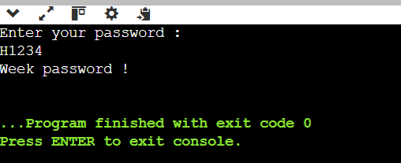
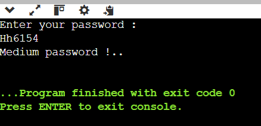
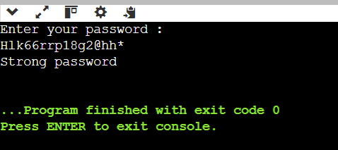

This project is a simple password checker built using Java .
It evaluates a password based on length, uppercase, lowercase, numbers, and special characters.

## Example Output:

## Weak Password 

## Medium Password 

## Strong Password 

